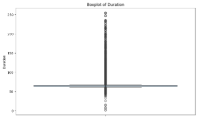
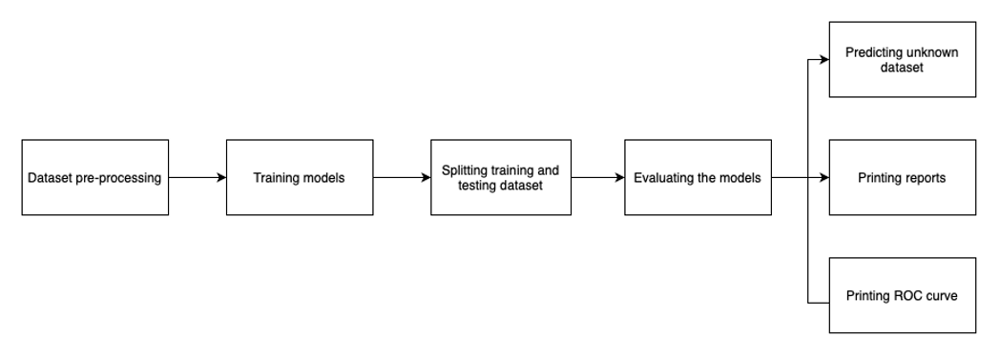
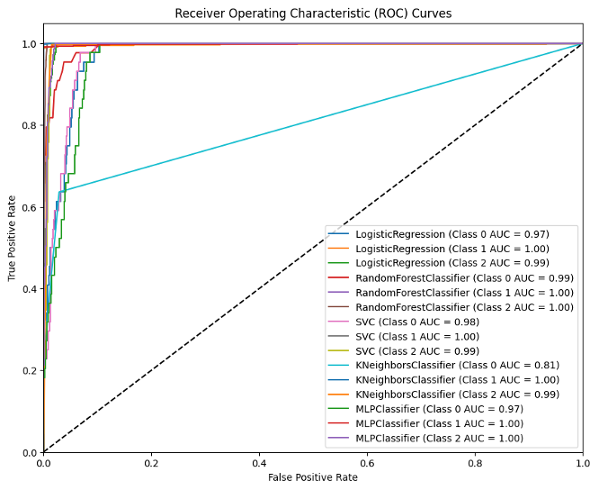
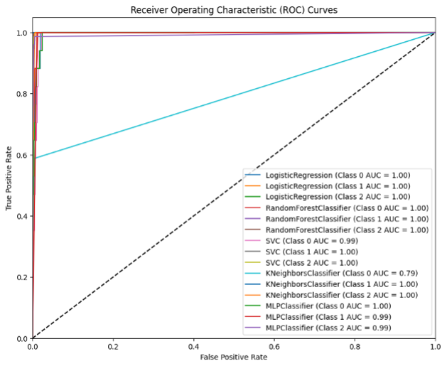

Great! Since your report contains helpful visuals like model architecture diagrams, outlier analysis plots, and ROC curves, we can integrate those into the `README.md` to enrich the explanation. Below is an updated version of your README that **references the images** (assumes you'll extract and upload them into a folder named `/images/` in your GitHub repo).

---

# 🚨 Intrusion Detection System using Machine Learning

This project presents the design and evaluation of a Machine Learning-based Intrusion Detection System (IDS) built using Python. It was completed as part of the *32130 Fundamentals of Data Analytics* course at UTS.

---

## 📌 Overview

The system classifies network intrusions based on labeled traffic features using various ML models. Pre-processing, model comparison, and evaluation were conducted to determine the most effective approach.

**Intrusion Classes:**

* `Mirai-greip_flood`
* `Recon-OSScan`
* `DictionaryBruteForce`

---

## 📁 Dataset

* `train_IoT_Intrusion_Detection.csv` — labeled dataset used for training
* `unknowndataset.csv` — unlabeled dataset used for prediction

Each record represents a network traffic snapshot with 48 features including:

* Packet durations
* Flag indicators (HTTP, DNS, TCP)
* Binary protocol usage
* Header lengths and rates

> 🧪 Missing or constant columns such as `Drate` and `Unnamed` were excluded based on EDA.

---

## 🔧 Technologies Used

* **Language**: Python
* **Libraries**: `pandas`, `numpy`, `matplotlib`, `scikit-learn`
* **Notebook**: [`intrusion_detection_system-2.ipynb`](./intrusion_detection_system-2.ipynb)

---

## 📊 Data Preprocessing

Preprocessing involved the following steps:

1. **Outlier Detection** using the IQR method 

2. **Feature Standardization**
   All numerical features were scaled to have zero mean and unit variance.

3. **Label Encoding**

   * `Mirai-greip_flood` → 0
   * `Recon-OSScan` → 1
   * `DictionaryBruteForce` → 2

4. **Dropped Columns**

   * `Drate` (constant = 0)
   * `Unnamed` (irrelevant index)
   * `Label` (during scaling)

---

## 🧠 Models Implemented

The following classifiers were evaluated:

| Model                      | Description                     |
| -------------------------- | ------------------------------- |
| **Random Forest**          | Ensemble of decision trees      |
| **K-Nearest Neighbors**    | Based on Euclidean distance     |
| **Logistic Regression**    | Linear classification algorithm |
| **Support Vector Machine** | Margin-based classifier         |
| **Multi-Layer Perceptron** | Feed-forward neural network     |



---

## 📈 Performance Metrics

We evaluated both **unprocessed** and **pre-processed** datasets on the following metrics:

* **Accuracy**
* **Precision**
* **Recall**
* **F1 Score**
* **ROC-AUC Curves**

---

### 🧪 Results Comparison (Unprocessed vs Pre-Processed)

#### Accuracy (Before vs After Preprocessing):

| Model               | Unprocessed | Preprocessed |
| ------------------- | ----------- | ------------ |
| Random Forest       | 99.42%      | **99.73%**   |
| Logistic Regression | 97.92%      | **99.37%**   |
| KNN                 | 98.1%       | 99.45%       |
| SVM                 | 98.5%       | 99.37%       |
| MLP Classifier      | 98.0%       | 99.37%       |

---

### 📊 ROC Curve Comparison

#### Unprocessed:



#### Pre-Processed:



---

## 🏆 Final Analysis

* **Random Forest** consistently outperformed other models, both in raw and processed datasets.
* Data preprocessing significantly improved model performance across all metrics.
* Surprisingly, **raw dataset** predictions scored higher on the **unknown test set**, indicating the real-world value of preserved outliers.

---

## 📌 Key Takeaways

✅ Preprocessing (especially outlier removal & standardization) boosts accuracy
✅ Random Forest is highly robust for intrusion detection
✅ Real-world testing must balance clean data with natural variability
✅ Visual analytics like ROC curves help in interpreting model quality

---

## 📁 Repository Contents

```
📂 intrusion-detection-ml/
├── intrusion_detection_system-2.ipynb     # Jupyter Notebook with code
├── fda_a3_25203896.pdf                    # Detailed report
├── images/
│   ├── outlier_duration.png
│   ├── code_flowchart.png
│   ├── roc_unprocessed.png
│   └── roc_preprocessed.png
└── README.md
```

---

## 📌 Future Work

* Expand attack classes and retrain with new datasets
* Integrate with a live packet sniffer (e.g., Wireshark + Scapy)
* Explore deep learning and real-time alerting mechanisms

---
